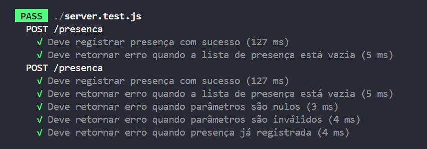

<p align="center">
  
</p>


## 🎯 Objetivo 

&emsp; O objetivo deste relatório é documentar um caso de teste de software relacionado ao projeto do Módulo 5 da Turma 9 - Engenharia de Software. Para isso, será utilizado o framework Jest para a realização de testes unitários e de integração.


&emsp; O caso de teste a ser documentado é referente à funcionalidade de envio de listas de presença para um banco de dados. A funcionalidade é composta por um endpoint que recebe uma lista de presença e a insere no banco de dados mockado.

### Tecnologias Utilizadas


<br>

## 🔍 Pré Condições 
Antes de executar os casos de teste, é necessário que:

- O ambiente esteja configurado com as dependências necessárias para a execução dos testes.
- O servidor esteja em execução.
- O banco de dados de presenças está funcional, seja ele mockado ou real.
- O sistema está acessível e operacional.

<br>

## 🛠️ Procedimentos de Teste

### Instalação de Dependências

&emsp; Certifique-se de que todas as dependências necessárias para execução dos testes estejam instaladas. Isso inclui o Jest e o Supertest. Para isso, execute o seguinte comando no terminal dentro do diretório do projeto:

```bash
npm install jest supertest --save-dev
```

&emsp; Aguarde até que todas as dependências sejam baixadas e instaladas com sucesso.

<hr>

### Execução dos Testes

&emsp; Após a instalação das dependências, você pode executar os testes utilizando o comando fornecido pelo Jest, adicionado ao arquivo `package.json`:

```bash
npm test
```

&emsp; Aguarde até que o Jest execute todos os testes, forneça os resultados no terminal e verifique se todos os testes foram concluídos com êxito.

<hr>

### Análise dos Resultados

&emsp; Após a execução dos testes, analise os resultados obtidos para garantir que todas as funcionalidades foram testadas e que não há falhas críticas. Em caso de falhas ou erros, é necesspario identificar a causa raiz e realizar correções necessárias no código ou nos testes.

&emsp; Após alterações, repita o processo de execução conforme necessário.

<br>

## 💭 Resultados Esperados

&emsp; No total, são esperados 5 casos de teste para a funcionalidade de envio de listas de presença, sendo esses:

| Caso de Teste                                                   | Status Esperado       | Corpo da Resposta                             |
|------------------------------------------------------------------|------------------------|-----------------------------------------------|
| Se a presença for registrada com sucesso                        | HTTP 201 (Created)    | { message: 'Presença registrada com sucesso.'}|
| Se a lista de presença estiver vazia                            | HTTP 400 (Bad Request)| { error: 'A lista de presença está vazia.'}   |
| Se algum dos parâmetros studentid ou classid for nulo            | HTTP 400 (Bad Request)| { error: 'Parâmetros nulos.'}                 |
| Se algum dos parâmetros studentid ou classid for inválido        | HTTP 400 (Bad Request)| { error: 'Parâmetros inválidos.'}             |
| Se a presença já estiver registrada no banco de dados           | HTTP 400 (Bad Request)| { error: 'Presença já registrada.'}           |

## ✅ Resultados Obtidos

<p align="center">
  
</p>

### Caso 1 - Se a presença for registrada com sucesso
- O sistema retornou um status HTTP 201 (Created).
- O corpo da resposta continha a mensagem "Presença registrada com sucesso.".
- O banco de dados de presenças contém um novo registro.

### Caso 2 - Se a lista de presença estiver vazia
- O sistema retornou um status HTTP 400 (Bad Request).
- O corpo da resposta continha a mensagem "A lista de presença está vazia.".
- O banco de dados de presenças não foi alterado.

### Caso 3 - Se algum dos parâmetros studentid ou classid for nulo
- O sistema retornou um status HTTP 400 (Bad Request).
- O corpo da resposta continha a mensagem "Parâmetros nulos.".
- O banco de dados de presenças não foi alterado.

### Caso 4 - Se algum dos parâmetros studentid ou classid for inválido
- O sistema retornou um status HTTP 400 (Bad Request).
- O corpo da resposta continha a mensagem "Parâmetros inválidos.".
- O banco de dados de presenças não foi alterado.

### Caso 5 - Se a presença já estiver registrada no banco de dados
- O sistema retornou um status HTTP 400 (Bad Request).
- O corpo da resposta continha a mensagem "Presença já registrada.".
- O banco de dados de presenças não foi alterado.

## 📊 Pós Condições

- O banco de dados de presenças pode conter novos registros, dependendo do resultado do teste.
- O sistema permanece acessível e operacional.
- O servidor permanece em execução, a menos que especificado de outra forma por alterações no código do teste.

<br>
<br>
<br>

<p align="center">
  
</p>